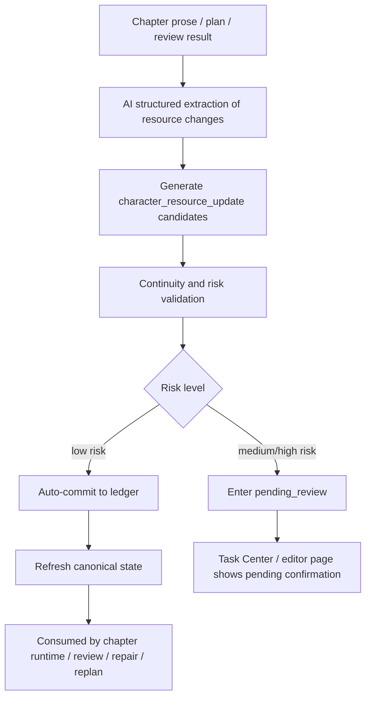

# Character Resource Ledger and Inventory System Execution Plan

For the related long-term character-system upgrade, see [character-system-upgrade-plan.md](./character-system-upgrade-plan.md). This file focuses on character resources and action-capability boundaries. Narrative roles, relationship tension, and chapter character context packs are planned together in the character-system upgrade.

## 1. Positioning

The character inventory must not be designed as standalone item CRUD, an equipment bar, or a lore encyclopedia. Its correct role in this project is:

> A character resource ledger that records what a character currently owns, can use, has lost, or is hiding, and how those resources affect later chapter planning, writing, review, repair, and replan.

Product language may call it “character carryables,” “key resources,” or “character inventory.” Engineering should standardize on `Character Resource Ledger`.

Its core goal is not to make the user maintain more notes. It is to make the system know, before writing the next chapter:

- what this character can do now;
- what this character must not suddenly do;
- which items or resources must be set up in advance;
- which key objects have already appeared but have gone unused for a long time;
- which resource changes will affect later plot windows.

## 2. Product Goals

### 2.1 Goals for beginner users

The target user is still a complete writing beginner who does not understand the writing process, so the character resource ledger must lower cognitive load:

- By default, AI extracts resource changes from chapters, plans, and review results;
- The user only handles high-risk confirmation and does not need to maintain every item by hand;
- The UI only shows resources that matter to the current writing decision;
- The system proactively flags continuity risk instead of asking the user to search historical chapters;
- Inventory information must enter the chapter writing chain; it cannot stay as display-only content on the character page.

### 2.2 Goals for the system main chain

The character resource ledger must plug into the current P0 main chain:

```text
book-level framing
  -> story macro planning / constraint engine
  -> dynamic character system
  -> volume strategy / volume skeleton / beat sheet
  -> chapter refinement bundle
  -> chapter execution / runtime
  -> state sync
  -> narrative audit / replan
```

New capability must serve “long-form narrative control,” not add an isolated page.

## 3. Scope Boundaries

### 3.1 This system owns

- Key resources a character currently holds or can invoke;
- Acquisition, transfer, hiding, consumption, damage, loss, and recovery of resources;
- Reader visibility, character knowledge state, and plot risk;
- Available-resource hints before chapter writing;
- Resource continuity checks during review and repair;
- Resource gaps, misuse, and stagnation risk during replan;
- Different tracking granularity for protagonists, long-running characters, and temporary characters.

### 3.2 This system does not own

- Game-like equipment stats, encumbrance, rarity, or combat-attribute systems;
- A complete inventory of everyday items, clothing, and ordinary consumables;
- A substitute for world management, faction resource stores, or the knowledge base;
- A substitute for the payoff ledger’s planted-setup recovery book;
- Requiring the user to fill a complete inventory before opening a book.

## 4. Character Layering Strategy

Different characters should not keep equally complex inventories. Layer by narrative weight.

### 4.1 Protagonist

The protagonist must have a full resource ledger.

The protagonist inventory is essentially an “action-capability boundary.” The system needs to know whether the protagonist has keys, evidence, identity credentials, weapons, funds, medicine, contacts, clue objects, special-ability tokens, and similar items.

Protagonist resources directly affect:

- whether this chapter can execute a given action;
- whether the next chapter must first set up a resource;
- whether review finds an item pulled from nowhere;
- whether repair should locally add setup or change the action plan;
- whether replan must adjust chapter windows.

### 4.2 Core supporting and long-running characters

Core supporting and long-running characters need a lightweight resource ledger.

Do not track every everyday item. Only track resources that affect plot:

- key clues;
- identity credentials;
- secret documents;
- relationship tokens;
- weapons or tools;
- permissions and connections;
- items transferred to or from the protagonist;
- promised objects that will pay off in later volumes.

These resources mainly protect action consistency, relationship progress, and chapter repair boundaries.

### 4.3 Antagonists and opponents

Antagonists and opponents need a “hidden resource ledger.”

This may not be called an inventory on the product side. It is closer to “hidden cards / available means”:

- people they can mobilize;
- locations they control;
- evidence they hold;
- unrevealed abilities;
- traps and setups;
- misleading resources aimed at the protagonist;
- not-yet-revealed truth entries.

The key for antagonist resources is visibility control. Reader, protagonist, and antagonist may know different things about the same resource, so a simple “has / does not have” is not enough.

### 4.4 Temporary characters

Temporary characters do not get a long-term inventory by default.

They only record “scene resources” in chapter context:

- a file handed over in the current scene;
- a one-time clue;
- a tool lent to the protagonist;
- an item stolen or taken away;
- a resource that may still affect later chapters after the scene ends.

If AI judges that a resource will be reused across chapters, affect conflict, bind to a planted setup, or be taken by the protagonist, it is automatically promoted to a formal ledger item.

### 4.5 Organization, location, and world resources

Some resources do not belong to a character. They belong to an organization, location, or world rule:

- a sect treasury;
- a company archive;
- a lab sample;
- a city restricted-area key;
- faction authorization;
- location control;
- cost resources in world rules.

The first version does not build a full organization inventory, but the data contract should reserve `ownerType`, allowing ownership of `character | organization | location | world | unknown`. Character holding is only `holder` and is not necessarily the same as ownership.

## 5. Resource Types

The first version should support these resource types:

- `physical_item`: physical objects, such as keys, knives, letters, medicine;
- `clue`: clue objects or evidence, such as photos, recordings, fragments, samples;
- `credential`: identity, permission, pass, token, authorization;
- `ability_resource`: ability tokens, contracts, remaining uses, cost slots;
- `relationship_token`: relationship tokens, promised objects, trade objects;
- `consumable`: money, ammunition, medicine quantity, remaining uses;
- `hidden_card`: hidden cards, traps, unrevealed means;
- `world_resource`: location, organization, and world-rule resources.

Resource classification is an AI structured judgment. Code only validates enums and post-processes. Do not use keyword rules as a fallback.

## 6. Core Data Contract

### 6.1 Resource ledger item

Add a shared type `CharacterResourceLedgerItem`:

```ts
type CharacterResourceOwnerType =
  | "character"
  | "organization"
  | "location"
  | "world"
  | "unknown";

type CharacterResourceStatus =
  | "available"
  | "hidden"
  | "borrowed"
  | "transferred"
  | "lost"
  | "consumed"
  | "damaged"
  | "destroyed"
  | "stale";

type CharacterResourceNarrativeFunction =
  | "tool"
  | "clue"
  | "weapon"
  | "proof"
  | "key"
  | "cost"
  | "promise"
  | "hidden_card"
  | "constraint";

interface CharacterResourceLedgerItem {
  id: string;
  novelId: string;
  resourceKey: string;
  name: string;
  summary: string;
  resourceType: string;
  narrativeFunction: CharacterResourceNarrativeFunction;
  ownerType: CharacterResourceOwnerType;
  ownerId?: string | null;
  ownerName?: string | null;
  holderCharacterId?: string | null;
  holderCharacterName?: string | null;
  status: CharacterResourceStatus;
  readerKnows: boolean;
  holderKnows: boolean;
  knownByCharacterIds: string[];
  introducedChapterId?: string | null;
  introducedChapterOrder?: number | null;
  lastTouchedChapterId?: string | null;
  lastTouchedChapterOrder?: number | null;
  expectedUseStartChapterOrder?: number | null;
  expectedUseEndChapterOrder?: number | null;
  constraints: string[];
  riskSignals: CharacterResourceRiskSignal[];
  sourceRefs: CharacterResourceSourceRef[];
  evidence: CharacterResourceEvidence[];
  confidence?: number | null;
  createdAt: string;
  updatedAt: string;
}
```

### 6.2 Resource events

The ledger item stores current state. Resource events store change history:

```ts
type CharacterResourceEventType =
  | "introduced"
  | "acquired"
  | "revealed"
  | "used"
  | "transferred"
  | "lost"
  | "consumed"
  | "damaged"
  | "destroyed"
  | "recovered"
  | "stale_marked";

interface CharacterResourceEvent {
  id: string;
  novelId: string;
  resourceId: string;
  chapterId?: string | null;
  chapterOrder?: number | null;
  eventType: CharacterResourceEventType;
  actorCharacterId?: string | null;
  fromHolderCharacterId?: string | null;
  toHolderCharacterId?: string | null;
  summary: string;
  evidence: string[];
  confidence?: number | null;
  createdAt: string;
}
```

### 6.3 Canonical state extension

Add a resource summary to `CanonicalCharacterRuntimeState`:

```ts
interface CanonicalCharacterResourceSummary {
  resourceId: string;
  name: string;
  status: CharacterResourceStatus;
  narrativeFunction: CharacterResourceNarrativeFunction;
  summary: string;
  constraints: string[];
  riskLevel: "none" | "info" | "warn" | "high";
}
```

Then add on character runtime state:

```ts
resources: CanonicalCharacterResourceSummary[];
```

Chapter runtime does not read the full ledger. It only reads resource summaries relevant to this chapter.

### 6.4 StateChangeProposal extension

Add a state-change type:

```ts
"character_resource_update"
```

Its payload uses a structured contract:

```ts
interface CharacterResourceUpdatePayload {
  resourceKey?: string;
  resourceId?: string;
  resourceName: string;
  updateType: CharacterResourceEventType;
  ownerType?: CharacterResourceOwnerType;
  ownerId?: string | null;
  holderCharacterId?: string | null;
  previousHolderCharacterId?: string | null;
  statusAfter: CharacterResourceStatus;
  visibilityAfter: {
    readerKnows: boolean;
    holderKnows: boolean;
    knownByCharacterIds: string[];
  };
  narrativeImpact: string;
  expectedFutureUse?: string | null;
}
```

Low-risk changes can auto-commit. High-risk changes enter `pending_review`.

## 7. AI Update Mechanism

### 7.1 Update sources

Resource changes come from four inputs:

- after chapter prose is complete;
- after chapter review and audit complete;
- after chapter repair completes;
- when volume planning, chapter refinement, or replan explicitly introduces a key resource.

### 7.2 Update flow



### 7.3 AI extraction output

Add a PromptAsset, recommended name:

```text
novel.character_resource.extract_updates@v1
```

Output shape:

```json
{
  "updates": [
    {
      "resourceName": "",
      "resourceType": "physical_item",
      "updateType": "acquired",
      "holderCharacterName": "",
      "ownerName": "",
      "statusAfter": "available",
      "visibilityAfter": {
        "readerKnows": true,
        "holderKnows": true,
        "knownByCharacterNames": []
      },
      "narrativeFunction": "clue",
      "narrativeImpact": "",
      "expectedFutureUse": "",
      "evidence": [],
      "confidence": 0.8,
      "riskLevel": "low",
      "riskReason": ""
    }
  ],
  "continuityRisks": [
    {
      "title": "",
      "summary": "",
      "severity": "medium",
      "blockingResourceNames": [],
      "suggestedAction": "confirm | repair | replan | ignore"
    }
  ]
}
```

### 7.4 Forbidden implementation

Do not implement product-core judgment with keyword tables, for example:

- seeing “picked up” and treating it as acquisition;
- seeing “lost” and treating it as loss;
- seeing “key” and hard-classifying it as a pass resource.

Those may be used as evidence locators or test fixtures. They must not become core routing or state judgment.

## 8. Auto-commit and Confirmation Policy

### 8.1 Eligible for auto-commit

Low-risk changes can auto-commit:

- the protagonist obtains an ordinary tool;
- a resource goes from never appearing to introduced;
- an item is used without changing the main plot;
- the chapter clearly writes an ordinary transfer between characters;
- a clue becomes known to a character;
- a temporary scene item is not reused across chapters.

### 8.2 Needs confirmation

These changes enter `pending_review`:

- a key item is destroyed;
- the protagonist loses a core action resource;
- an antagonist hidden card is revealed early;
- resource ownership conflicts with the existing ledger;
- using the resource would change volume-level planning;
- the resource conflicts with a payoff-ledger fulfillment window;
- a resource appears suddenly with no setup;
- AI confidence is below threshold.

### 8.3 Explicit rejection

These candidates should be rejected or marked dirty:

- insufficient evidence;
- only figurative language;
- hallucinated characters or items;
- conflict with chapter prose facts;
- strong conflict with already confirmed ledger state that cannot be explained.

## 9. UI Design

### 9.1 Character page: resource overview

Add a “Key resources” area to the character detail page.

The protagonist is expanded by default. Long-running characters default to a collapsed summary. Temporary characters do not show a long-term inventory by default.

Display fields:

- currently available resources;
- hidden resources / hidden cards;
- recent changes;
- needs confirmation;
- risk hints;
- resources related to the next chapter.

User actions:

- confirm a resource change;
- mark a resource as unimportant;
- manually add one key resource;
- view resource history;
- jump to the source chapter.

UI copy should speak from the user’s perspective, for example:

- “This character can currently use these key resources”
- “These resources may affect next-chapter actions”
- “These changes need confirmation before they enter later writing”

Avoid implementation commentary such as “the resource ledger is now wired into canonical state.”

### 9.2 Chapter prep area: this-chapter resource hints

Before chapter execution, add “This chapter’s key resources” to the chapter prep or execution panel.

Show:

- suggested use this chapter;
- setup needed this chapter;
- do not use early this chapter;
- resources missing but required by the current plan;
- resources related to payoff / planted setup.

These hints should not become a large configuration table. They exist to lower beginner risk:

- “Before writing this chapter, the system suggests letting the protagonist obtain a pass credential first”
- “This evidence has not been discovered by the protagonist yet and cannot be used directly for deduction”
- “This item is already damaged and should not continue in normal use in the current chapter”

### 9.3 Review and repair area: continuity risk

Add resource continuity issues to review results:

- used without having obtained;
- reused after consumption;
- still held by the original character after transfer;
- treated as already set up while the reader does not know;
- acted on while the character does not know;
- a key resource untouched for a long time.

Repair suggestions prefer `patch_first`:

- locally add one sentence of acquisition source;
- remove unreasonable use;
- move resource use later;
- have another character provide the resource;
- trigger replan.

### 9.4 Task Center and pending review

When a resource change needs confirmation, Task Center shows:

- which character;
- which resource;
- what the system thinks changed;
- why confirmation is needed;
- which later chapters or plans confirmation will affect.

Actions:

- confirm into the ledger;
- reject;
- mark as low importance;
- ask AI to re-judge;
- jump to the source chapter.

### 9.5 Volume workbench: resource-commitment view

The volume workbench does not show the full inventory. It only shows cross-chapter resource commitments:

- key objects that must appear this volume;
- resources that must be consumed or transferred this volume;
- current-volume resource gaps;
- key objects that affect payoff;
- hidden cards that later volumes need to keep.

This prevents the “resource ledger” from existing only on the character page and never participating in long-form pacing control.

## 10. Backend Components

### 10.1 New services

Suggested additions:

- `CharacterResourceLedgerService`
  - read and write the resource ledger;
  - merge same-name or synonymous resources;
  - compute character resource summaries;
  - generate chapter-related resource windows.

- `CharacterResourceExtractionService`
  - call the PromptAsset;
  - extract resource changes from chapter prose, plans, and review results;
  - generate `StateChangeProposal`.

- `CharacterResourceValidationService`
  - validate resource continuity;
  - compute risk level;
  - decide auto-commit, pending confirmation, or reject.

- `CharacterResourceContextBuilder`
  - build lightweight context for runtime, review, repair, and replan;
  - avoid stuffing the full ledger into the model.

### 10.2 Suggested tables

First version should add:

- `CharacterResourceLedgerItem`
- `CharacterResourceEvent`

Optional:

- `CharacterResourceReview`
  - if pending review needs its own UI state;
  - existing `StateChangeProposal` may also be reused first.

### 10.3 Suggested APIs

First batch:

- `GET /api/novels/:id/character-resources`
- `GET /api/novels/:id/characters/:characterId/resources`
- `GET /api/novels/:id/chapters/:chapterId/resource-context`
- `POST /api/novels/:id/chapters/:chapterId/resources/extract`
- `POST /api/novels/:id/character-resources/:resourceId/events`
- `POST /api/novels/:id/character-resource-proposals/:proposalId/confirm`
- `POST /api/novels/:id/character-resource-proposals/:proposalId/reject`

API responses should include summaries the UI can consume directly. The frontend should not have to assemble complex state.

## 11. Relationship to Existing Modules

### 11.1 Dynamic character system

The character resource ledger is an execution-time reinforcement of the dynamic character system.

The existing dynamic character system focuses on:

- character goals;
- current state;
- faction trajectory;
- relationship stage;
- absence risk;
- in-volume duties.

The resource ledger adds:

- character action resources;
- resource visibility;
- item continuity;
- later-use windows for hidden cards and tools.

### 11.2 Canonical state

The resource ledger is not a new large source of truth. It should be a domain-owned formal asset, summarized into a current-state view by `CanonicalStateService`.

Principles:

- the resource ledger stores long-term facts;
- canonical state stores the lightweight view needed for current production;
- runtime / review / repair only consume the resource window relevant to the current task;
- all long-term changes enter formal state through `StateChangeProposal -> StateCommitService`.

### 11.3 Payoff ledger

The payoff ledger owns “narrative promises.” The resource ledger owns “character resources and action boundaries.”

They overlap, but must not merge:

- a gun can be a resource ledger item;
- if that gun was set up in advance and must be used in chapter 10, it also links to the payoff ledger;
- the payoff ledger owns fulfillment windows and risk;
- the resource ledger owns hold state, visibility, and use continuity.

### 11.4 Chapter runtime

Pre-writing context should include:

- current key resources of participating characters;
- resources the chapter plan needs;
- missing resources;
- resources that must not be used early;
- high-risk resource constraints.

This should enter chapter execution context. The writer should not infer it from long-form notes.

### 11.5 Review / repair / replan

Review:

- find resource continuity issues;
- mark missing setup;
- mark resource visibility errors.

Repair:

- prefer local setup patches;
- change unreasonable use;
- trigger replan when necessary.

Replan:

- adjust resource appearance windows;
- move setup chapters earlier;
- move use chapters later;
- change character action plans.

## 12. Phased Implementation Plan

### Phase 0: Design and contract freeze

Goal: freeze system boundaries, data contracts, and main-chain attachment points.

Tasks:

- add shared type drafts;
- freeze Prisma models;
- freeze PromptAsset input and output;
- freeze the `StateChangeProposal` extension;
- freeze UI entrypoints and first-version display scope;
- freeze auto-commit and pending-review policy.

Acceptance:

- docs, type drafts, and API drafts are consistent;
- no duty conflict with payoff ledger, dynamic character, and canonical state;
- beginner UI does not require the user to fill a full inventory by hand.

### Phase 1: Minimal resource-ledger backend

Goal: persist, read, and summarize character key resources.

Tasks:

- add `CharacterResourceLedgerItem` and `CharacterResourceEvent`;
- add service and mapper;
- add character resource list APIs;
- add resource summaries to character runtime-state summaries;
- add minimal server tests.

Acceptance:

- protagonist and long-running characters can read current key resources;
- resource events can be traced to chapters;
- canonical state can read a lightweight resource summary;
- existing chapter writing chain is unaffected.

### Phase 2: AI resource-change extraction

Goal: automatically extract resource changes after a chapter completes.

Tasks:

- add `novel.character_resource.extract_updates@v1` PromptAsset;
- hook into background sync after chapter completion;
- generate `character_resource_update` candidates;
- implement low-risk auto-commit and high-risk pending confirmation;
- integrate `StateCommitService`.

Acceptance:

- key resources clearly obtained, transferred, or consumed in a chapter can be extracted;
- hallucinated resources do not enter the ledger directly;
- high-risk changes enter pending review;
- resource changes can refresh later context.

### Phase 3: Runtime / review / repair consumption

Goal: make the resource ledger actually affect chapter production.

Tasks:

- add this-chapter resources to runtime context;
- add resource continuity checks to review;
- add `patch_first` repair suggestions for resource issues;
- let replan see resource gaps and misuse risk;
- add targeted regression tests.

Acceptance:

- characters do not easily use unobtained resources;
- consumed resources are not reused as if still available;
- when a key resource is missing, the system suggests setup first or rewriting the action;
- repair defaults to local patch first.

### Phase 4: First UI version

Goal: users can see and confirm the resource ledger without understanding the internal state system.

Tasks:

- add a “Key resources” area on the character page;
- add “This chapter’s key resources” to chapter prep;
- show resource continuity issues in review results;
- show pending resource-change confirmation in Task Center;
- show a cross-chapter resource-commitment summary on the volume workbench.

Acceptance:

- protagonist resources are clearly visible by default;
- long-running characters only show key resources;
- temporary-character resources default to chapter-context display only;
- users can confirm or reject high-risk changes;
- UI copy explains function and next step from the user’s perspective.

### Phase 5: Cross-volume resource commitments and advanced capability

Goal: let the resource ledger participate in long-form pacing control.

Tasks:

- attach resource-use windows to the volume workbench;
- add optional links between resources and the payoff ledger;
- add stagnation, false-recovery, and early-reveal risk;
- support fuller ownership for organization / location resources;
- support resource backfill for old projects.

Acceptance:

- the system can warn “this key object has been set up but unused for a long time”;
- the system can warn “this resource should be kept this volume; do not consume it early”;
- replan can adjust chapter windows from resource state;
- old projects can backfill key resources through AI sampling.

## 13. Test Plan

### 13.1 Server tests

- create, update, and read the character resource ledger;
- resource-event order and chapter references;
- same-name resource merge and conflict detection;
- low-risk auto-commit;
- high-risk pending review;
- canonical-state resource summary;
- runtime-context resource trimming;
- review resource continuity issues;
- repair local-patch suggestions;
- replan resource-gap judgment.

### 13.2 Prompt regression

Fixed fixtures covering:

- protagonist obtains a key;
- protagonist hands evidence to a supporting character;
- antagonist secretly keeps a hidden card;
- an item is consumed;
- an item is only figurative and should not enter the ledger;
- a temporary character provides a clue and then disappears;
- a resource relates to a payoff fulfillment window;
- a chapter appears to use an unset-up resource.

### 13.3 Frontend acceptance

- protagonist character page shows full key resources;
- long-running characters show lightweight resources;
- temporary characters do not enter the long-term inventory by default;
- before chapter execution, this chapter’s available resources and gaps are shown;
- review issues can jump to the related resource;
- pending review can confirm, reject, and jump to the source chapter;
- UI copy has no implementation-migration wording.

## 14. Risks and Trade-offs

### 14.1 Maintenance cost too high

Risk: the inventory becomes another large table the user must maintain by hand.

Countermeasures:

- default to AI extraction;
- show only key resources;
- do not promote temporary resources to long-term by default;
- interrupt the user only for high risk.

### 14.2 AI-hallucinated resources

Risk: the model extracts resources that do not exist and writes them into state.

Countermeasures:

- extraction must carry evidence;
- low confidence enters pending confirmation;
- cross-check against existing characters, chapters, and plans;
- high-impact resources do not auto-commit.

### 14.3 Context bloat

Risk: stuffing the full inventory into the writer slows generation and interferes with prose.

Countermeasures:

- runtime only consumes this-chapter windows;
- trim by participating characters, chapter goals, and resource risk;
- full ledger detail is only for review, repair, and UI.

### 14.4 Overlap with payoff ledger

Risk: both the resource ledger and the planted-setup ledger track key objects.

Countermeasures:

- payoff ledger owns promises and fulfillment;
- resource ledger owns hold, visibility, and use state;
- connect with optional links; do not merge duties.

## 15. Recommended Priority

Treat this capability as a sub-item of `P0-B / P0-E1`:

- it reinforces “dynamic character system entering execution-time behavior judgment”;
- it depends on canonical state and StateCommitService;
- it can improve consistency of chapter runtime, review, repair, and replan;
- it can reduce the burden of beginners manually watching continuity.

Do not promote it to an independent large module or a first-level nav item at this stage. The first version is better embedded in the character page, chapter prep, review area, and Task Center.

## 16. Minimum Deliverable Definition

The first deliverable only needs to achieve:

- protagonist and long-running characters have a key-resource ledger;
- AI can extract resource changes after a chapter completes;
- low risk auto-commits; high risk waits for confirmation;
- before chapter writing, this-chapter resources are visible;
- review can identify at least three kinds of resource continuity issue;
- users can confirm or reject resource changes in the UI.

Once that loop runs, the character inventory has already moved from “lore management” to part of “long-form narrative control.”

## 17. Development Progress Sync (2026-04-25)

This section records the actual landing status of this round’s character inventory / character resource ledger, so the execution plan, TASK records, and code progress do not drift apart.

### 17.1 Closed loop completed

- Data layer and shared types are done: added character resource ledger items, resource events, resource status / type / narrative-function enums, risk signals and source evidence, plus Novel, Character, and Chapter relations and indexes.
- AI extraction and state commit are wired: `novel.character_resource.extract_updates@v1` is registered as a PromptAsset; chapter resource changes generate `character_resource_update` proposals; low risk auto-commits; high risk, low confidence, and key destroy / consume stay pending confirmation.
- Chapter context consumes resource windows: writing, review, repair, and replan only inject this-chapter resource summaries and do not stuff the full ledger into runtime.
- First API and UI version landed: novel / character / chapter resource reads, plus extract, confirm, and reject resource proposals; character prep page shows key resources; chapter execution page shows this chapter’s key resources.
- Current novel data received a controlled repair: one character-dynamics rebuild on *Ancient Sword Chronicles* restored 5 volume-level character duties; 16 historical background resource proposals eligible for auto-ledger were confirmed; remaining 14 high-risk or insufficient-evidence resource changes stay pending confirmation.

### 17.2 Sync throttling and token protection

- Volume-level character dynamics are no longer rebuilt on every chapter sync; they currently trigger only on version activation, old-data migration, or the first workspace update that has chapter content.
- `chapter_execution_contract_refined` and ordinary chapter sync no longer trigger character volume-projection recalculation, avoiding repeated large character-token spend on the chapter refinement / execution chain.
- Background chapter resource extraction adds same-chapter same-stage idempotency: Auto-Director extracts a given chapter only once automatically; later repair, retry, or background sync does not rerun resource extraction.
- Manual resource extraction still keeps override capability for when the user actively asks to re-identify this chapter’s resource changes.
- Empty or invalid projections do not clear existing `CharacterVolumeAssignment`; AI output must include a non-empty assignment, and faction / relation projections must carry a valid volume order.

### 17.3 Auto-Director confirmation policy

- Low-risk and medium-risk resource changes produced in Auto-Director background default to auto-ledger, reducing frequent interruptions in auto mode.
- High-impact, low-confidence, high-risk, key-resource destroy / consume, hidden-card reveal, and major ownership changes still enter pending confirmation.
- The pending-confirmation entry explains to the user that “confirmation will affect later writing,” and only keeps changes that truly need human judgment.
- The resource ledger continues to own hold, visibility, use state, and action boundaries; the planted-setup ledger continues to own narrative promises and fulfillment windows.

### 17.4 UI progress

- Character prep page has a “Key resources” view: full display for the protagonist, lightweight display for long-running characters, and no long-term promotion for temporary characters by default.
- “This chapter’s key resources” on the chapter execution page moved to the right execution sidebar, near execution actions and chapter status, so it does not crowd the prose-planning area.
- The chapter resource panel aggregates available resources, needed setup, cannot-use-early, missing resources, and pending-confirmation resources.
- Review / repair can consume resource continuity risk to flag used-without-obtained, reused-after-consumed, wrong ownership after transfer, and wrong knowledge-state issues.

### 17.5 Verification status

This round’s targeted verification completed:

- `pnpm --filter @ai-novel/server build`
- `pnpm --filter @ai-novel/client build`
- `node --test tests/stateCommitService.test.js tests/novelDirectorAutoExecutionStatus.test.js tests/chapterLayeredContext.test.js`

### 17.6 Remaining work

- The current project still has historical resource proposals pending confirmation, mainly high-risk, destroy / consume, insufficient-evidence, or human-judgment resource changes; they can already be handled through the chapter panel and the novel task drawer.
- Old Auto-Director task status restore / cancel policy needs separate handling; it belongs to task runtime governance, not the character inventory ledger itself.
- Later work can further strengthen explicit resource-to-payoff-ledger links, finer organization / location resource ownership, and a more complete resource history timeline.

### 17.7 Mode-difference follow-up (2026-04-25)

- The chapter execution page now distinguishes Auto-Director mode and manual mode: while Auto-Director is running it shows “auto sync,” ordinary resource changes auto-ledger, and only high-risk changes are left for the user.
- Manual writing mode added a “Recheck this chapter’s resources” entry: after the user edits prose they can actively trigger this-chapter resource extraction; low risk is used directly for later writing; medium-risk and uncertain changes enter pending confirmation.
- This chapter’s key-resource panel only shows pending resource changes for the current chapter, so other chapters’ historical proposals do not interfere with current execution.
- Proposal summaries now carry source information so the frontend can distinguish “found by auto sync” from “found by manual recheck,” helping the user tell whether a change came from background director or an active recheck.
- This round verified with `pnpm --filter @ai-novel/shared build`, `pnpm --filter @ai-novel/server build`, `pnpm --filter @ai-novel/client build`, and targeted resource-commit / chapter-context tests.

### 17.8 Closing-loop follow-up (2026-04-25)

- The novel task drawer now shows “resource changes pending confirmation”: users can inspect source, confirm into the ledger, or ignore a change in the task panel, without having to enter a specific chapter first.
- Task-panel resource proposals show resource name, holder character, risk level, evidence, judgment reason, and source type, and support jumping back to the source chapter.
- The volume-strategy page added “this volume’s key resource commitments”: it only shows resources that affect this volume’s action boundaries, setup, or later fulfillment, avoiding moving the full inventory onto the volume workbench.
- Character prep page added a “Backfill recent chapters” entry for lightweight resource backfill on old projects or existing prose; by default it only scans the latest 3 chapters that have prose, and the backfill chain keeps an idempotency checkpoint to avoid repeated token spend.
- Resource recheck / backfill submit explicitly skips generic chapter-fact extraction and only handles character-resource proposals, so resource work does not incidentally change other state.
- This round continued to pass shared/server/client build and targeted resource-commit / chapter-context tests.
