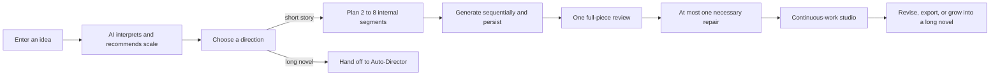

# Creation Studio and short-story closed loop

## Background

Long-form Auto-Director is good at staged production, but using it as the entry for every creation forces the user to understand genre, structure, setup, and production stages before they can say what they actually want to write. Short stories also need faster complete delivery, continuous reading, and low-cost revision. They cannot be a shortened long-form chapter chain.

Creation Studio therefore bridges "user idea" to a formal production chain: the user expresses an idea, AI interprets and recommends work scale, the user only confirms a direction, then the backend chooses the short-story production chain or existing long-form Auto-Director.

## Decision

- `NarrativeForm` is the work shape: `short_story` or `long_novel`.
- `creationExperience` only controls simple/professional experience for existing long-form work. It does not participate in short-story routing.
- `creation_studio` is an independent workflow lane. Lane display, recovery, and capability are maintained through a description registry. Do not keep extending binary checks against `auto_director`.
- AI interprets intent, recommends form and target length, and produces two differentiated directions through a structured Prompt contract. Deterministic code only validates range and structure. It does not judge work scale with keywords or regex.
- Short stories use an independent formal production chain. Long-form confirmation hands off to existing Auto-Director. Do not copy long-form production capability.

## Current Rule

When the user accepts recommended values, idea-to-production needs only two required actions: submit idea, confirm direction. After the user changes form or length, AI must re-adapt both directions. Do not force the old directions onto the new scale.

Home and the novel list treat "Auto-Director for a long novel" and "create a short story" as parallel entries. The short-story entry explicitly passes a `short_story` preference so AI organizes directions around short-story scale. The Auto-Director entry still enters the existing long-form opening flow. Entries remain behind the Creation Studio feature switch and can be turned off together during pre-release acceptance.

Creation Studio's initial state uses an editor-style creation canvas, not stacked form cards or decorative chrome. The first screen emphasizes idea input and Generate creation directions. Character counts appear on demand. Full settings stay a secondary entry.

## Intent Version Contract

- `NovelIntentVersion.originalExpression` stores the user's original expression.
- `structuredIntentJson` stores AI's full structured understanding.
- `impactScopeJson` stores direction choice or revision impact scope.
- A work has only one active intent version. Natural-language revisions first create a pending version. The active state switches only after user confirmation.
- Confirming a creation direction uses a stable idempotency key and `CreationStudioConfirmation`. Repeat requests reuse the same work and production task. They must not create a second chain.

## Short-Story Production Rules

- First-phase target length is 3,000–30,000 words. AI decides 2–8 internal segments.
- In this product, a short story is shorter web fiction that can be read in one sitting and fully resolves. It is not an essay, literary sketch, synopsis, or screenplay breakdown. Subject matter can be restrained or lyrical, but it must keep web-fiction immediate hooks, active goals, ongoing propulsion, genre payoff, and a clear ending.
- New plans use schemaVersion 2. Besides start/end state, each internal segment must also provide an opening hook, immediate goal, 2–6 causal propulsion beats, genre payoff, and ending pull, so prose generation does not receive only an abstract "segment purpose".
- Prose is organized for phone reading and advances through concrete scenes, action, choices, and natural dialogue. The first 300–500 words of segment one enter pressure, anomaly, conflict, or a decision point. Do not open with long scenery, dreams, origin exposition, or world-setting slow burn.
- Web-fiction payoff is chosen by genre: breakthrough, counterattack, revelation, identity change, relationship fulfillment, or emotional release. Do not mechanically write every work as face-slapping power fantasy.
- Segments are backend recovery cursors, not reader-facing chapters. Frontend and export present continuous prose only.
- Generation order is fixed: plan, write segment by segment, full-piece review, at most one repair.
- Completed segments are reused directly. Failure continues from the current segment. A leftover `generating` state after abnormal exit may be reclaimed only after the lease expires, to prevent concurrent double writes.
- Ordinary quality problems complete delivery as quality debt. Stop the task only for explicit replan required, no usable prose, or runtime safety / data-integrity failure.
- Full-piece review must check hook, protagonist action, scene propulsion, reversal and payoff, paragraph readability, and ending fulfillment. Vague lyricism, synopsis-like prose, oversized dense paragraphs, or fragment abuse are repairable problems and must not be misread as advanced style.

## Edit And Rewrite Protection

- Direct edits save by internal segment and use `expectedVersion` for optimistic concurrency.
- Create a prose snapshot before every manual save or confirmed AI rewrite.
- Auto repair and failure recovery must not overwrite segments marked as user-edited.
- Natural-language revision first shows AI understanding, affected segments, whether ending / scale / core intent change, and a recommendation among local repair, downstream rewrite, or full replan.
- Every AI rewrite of completed prose requires explicit user confirmation.

## Recovery And Routing

- Before direction confirmation, recover to `/create?taskId=...`.
- After short-story create, recover to `/novels/:id/story`.
- Long-form tasks keep using Auto-Director recovery entries.
- On service start, resume queued or running short-story tasks. Failed tasks can continue explicitly from the work page.
- Explicit `replan_required` must not be cleared by ordinary retry. The user must first confirm a new creation direction.

## Promote Short Story To Long Novel

"Grow into a long novel" creates a new creation task that inherits the short story's active intent, core characters, conflict, ending promise, and finished-draft summary. After the user reconfirms a long-form direction, a new `long_novel` is created and handed to Auto-Director. The original short story stays unchanged. The new long novel records origin through `derivedFromNovelId`.

## Creative Hub Boundary

Creative Hub can understand goals such as "write this idea as a short story" and guide or start a Creation Studio task. It must not execute short-story planning, segmented writing, full-piece review, repair, or prose rewrite inside a chat request. Those heavy actions must enter a formal workflow, Prompt Registry, and task projection.

## Failure Modes

- Retry confirm creates two works: check whether the client reused a stable idempotency key, and whether the confirmation unique constraint is in effect.
- Refresh rewrites from scratch: check whether plan and segments persisted, and whether completed segments were treated as pending.
- Manual prose is overwritten: check whether `userEditedAt`, snapshots, and write conditions all take effect together.
- Ordinary review issues stop the whole piece: check whether they were wrongly mapped to `replan_required` or a failed task.
- Short-story export shows segment titles: check whether export uses continuous prose instead of reusing long-form chapter format.
- Creative Hub can write a short story but Task Center has no record: the formal workflow was bypassed. Pull it back into Creation Studio.

## Related Modules

- `server/src/modules/novel/creation-studio/`
- `server/src/modules/novel/short-story/`
- `server/src/prompting/prompts/creation/`
- `server/src/prompting/prompts/shortStory/`
- `server/src/services/novel/workflow/`
- `client/src/pages/creationStudio/`
- `client/src/pages/shortStory/`

## Source Documents

- [Creative Hub boundary](creative-hub-boundary.md)
- [Beginner-first full-novel completion](../product/beginner-first-novel-completion.md)
