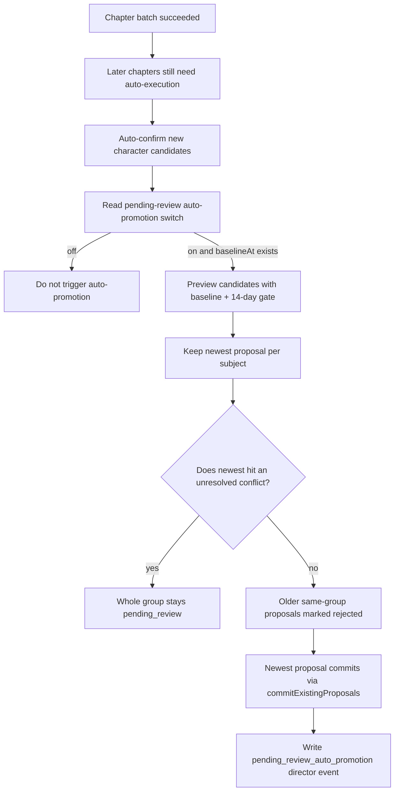

# Pending-review state-proposal auto-promotion

## Background

`relation_state_update` and `information_disclosure` are human-review types among state proposals. They affect relationship progress and what characters/readers know. Sitting in `pending_review` for a long time weakens later chapters' continuity for relationship change and information reveal.

Auto-promotion does not cancel human review. It gives a controlled commit path to low-risk proposals that were created after the switch was turned on, have waited long enough, and hit no unresolved conflict. The capability defaults off. When off, system behavior matches not having this capability.

## Decision

Auto-promotion must satisfy four bounds at once:

- Default off. Pulling the code into any environment must not auto-process pending proposals.
- First enable records `baselineAt` and processes only proposals with `createdAt > baselineAt`.
- Enable requires a server-validated confirmation credential. An ordinary toggle must not fire it by accident.
- Every run must write a director event trail covering commits, supersedes, skips, and decision grounds.

## Current Rule

Processable types are only:

- `relation_state_update`
- `information_disclosure`

Candidate gates:

- Proposal status must be `pending_review`.
- `createdAt` must be later than settings `baselineAt`.
- Proposal age must be at least 14 days.
- For the same subject, process only the newest proposal. Older proposals in the group are marked `rejected` only when the newest can be promoted, with reason "Superseded by a newer proposal".
- If the newest proposal hits an unresolved conflict, the whole group stays `pending_review`.
- Each run has a processing cap so an abnormal scene cannot commit too many proposals in one batch.

Subject grouping:

- `relation_state_update`: `sourceCharacterId + targetCharacterId`
- `information_disclosure`: `holderType + holderRefId + fact`

Conflict skip rules:

- An unresolved same-chapter conflict hits the candidate proposal.
- The conflict record's `affectedCharacterIdsJson` hits characters related to the candidate.
- An information-cognition proposal's `fact` hits the conflict title, summary, key, evidence, or handling suggestion.

## Runtime Flow

The Auto-Director join point is a background maintenance action after a successful chapter batch, using a fire-and-forget call. Failure must not change chapter generation, quality repair, pause, or continue control flow.

## Settings Contract

Settings persist in `AppSetting`:

- `qualityDebt.pendingReviewAutoPromotion.enabled`
- `qualityDebt.pendingReviewAutoPromotion.baselineAt`

`baselineAt` is written only on first enable. Turning off and on again must not overwrite that time, so earlier stock proposals stay outside auto-processing. The settings page must keep showing enabled state and baseline time.

## Trace Contract

Every non-dry-run execution records `DirectorEvent.type = pending_review_auto_promotion`. Metadata must include at least:

- Decision gates: baseline, 14-day age gate, run limit, proposal types.
- promoted proposal ids.
- superseded proposal ids.
- conflict skipped records.
- run-limit deferred proposals.
- executedAt.

This event later explains why a relationship or cognition state was auto-committed, and supports human review or a future reverse-assist tool.

## Failure Modes

- **Missing baseline**: even with `enabled = true`, missing `baselineAt` is treated as not executable.
- **Conflict detection too wide**: candidates stay in `pending_review` and do not pollute canonical history, but backlog still needs human handling.
- **Conflict detection too narrow**: a proposal may be committed. Risk is controlled by default-off, the 14-day wait, the trail, and the run limit.
- **Long unhandled queue**: proposals that miss auto-promotion conditions still accumulate and need a later batch-review entry or human workspace.

## Related Modules

- `server/src/services/settings/QualityDebtSettingsService.ts`
- `server/src/services/novel/state/PendingReviewAutoPromotionService.ts`
- `server/src/services/novel/state/stateProposalSubjectKey.ts`
- `server/src/services/novel/director/automation/novelDirectorAutoExecutionRuntime.ts`
- `server/src/services/novel/state/StateCommitService.ts`
- `server/src/services/state/OpenConflictService.ts`
